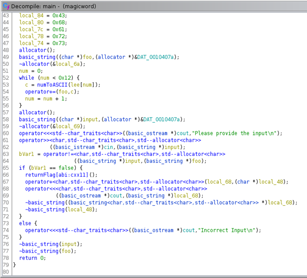
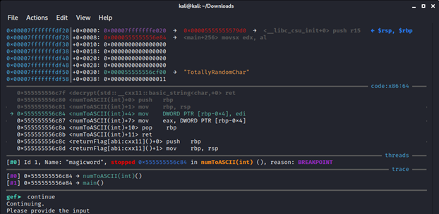
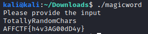

# Magic Word

### Challenge

The challenge's description was as follows:

&nbsp;&nbsp;&nbsp;&nbsp;&nbsp;&nbsp;We need a magic word to get the response here, can you discover it?

The magicword file included in this folder was also a part of the description.

### Solution

I began by running this file through Ghidra. Note: Ghidra does not come by default in Kali Linux, but it was a simple install.

In the output of Ghidra, the main function of this executable was seen as above; I did rename some variables for my own clarity.

It can be seen that the first while loop fills the `foo` string. The input is then retrieved with cin and put into the `input` variable. Afterwards, the `input` and `foo` strings are compared, and the opposite of that comparison is stored into `bVar1`. I wanted `bVar1` to be false in this case—meaning both strings have to be equivalent—because this should run the contents of the if-statement rather than the else-statement that runs when there is "Incorrect Input."

A simple way to know the contents of the `foo` variable is through gdb. While doing this, I created a breakpoint on the numToASCII() line in the first while loop within the main function; however, it would have been smarter to set a breakpoint at the comparison of the two strings. Nonetheless, the partial contents of `foo` were viewed as seen in the image above. "TotallyRandomChar" does not make sense contextually; therefore, "TotallyRandomChars" was tested as input to the magicword file. Remember, you must make the file executable by `chmod +x magicword` so that it may be run.

As shown above, the flag turned out to be AFFCTF{h4v3AG00dD4y}. How thoughtful!
