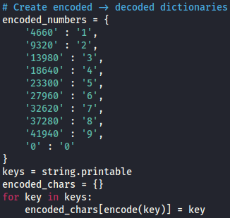
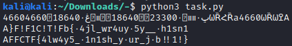

# TODO

### Challenge

On our victim's computer, there was some old script. It looks like someone left the message and the unfinished function used to read the content of that message. We have to obtain the message, could you do that?

Additionally, a task.py file was given; it may be found in this writeup's directory.

### Solution

Note: If you prefer looking at code rather than words, my completed version of task.py can be found in this folder as task_complete.py.

There are two functions of the code that lack functionality: the decode() and unshift() functions. Additionally, main must be completed. Three extremely important lines found in main are as follows:

`# shifted = shift('<REDACTED>')`

`# hashed = encode(shifted)`

`hashed = '4660۠ܰ4660ڀ٠װװސ23300۰ސݐ18640ܠݰװۀڠ18640۰ްؠѠȐՀȐа4660ѠȐѠߐА'`

These lines show that whatever the original input was has been shifted and hashed. This means we are responsible for first decoding this hash and then unshifting that.

After overcomplicating this problem, I realized all alphabetic characters map to a single character with no deviation when encoded; therefore, this mapping could be reversed and utilized as a dictionary. Note that there were a few characters, including f and o, that remained dots through encoding and decoding. Additionally, all numeric characters mapped to the same values, but these values varied in sizes. The creation of the dictionaries can be seen below; this was done in the decode() function.

From here, decoding was much simpler. First, the characters were decoded utilizing the `encoded_chars` dictionary. Next, the string had to be reversed for the numeric dictionary replacements. Following the numeric decoding, the strings were reversed back to normal.

Now for the unshifting! Rather than directly reverse engineer the shift() function in front of me, I tested a string of "0123456789" to see where characters get shifted to. This string shifted turns into "0918273645." A pattern can be seen in this. Starting from 0, the numbers are placed by skipping 1. Once the length of the string has been reached, they turn around and fill in those blanks.

With all this information, I completed the task.py TODOs. The finished code may be found in the folder of this writeup as task_complete.py. The flag may be seen above. As mentioned before, the dictionary method is not flawless, so the f's and o's decoded as dots; however, the flag is AFFCTF{4lw4ys5_f1n1sh_your_job!!1!}.
