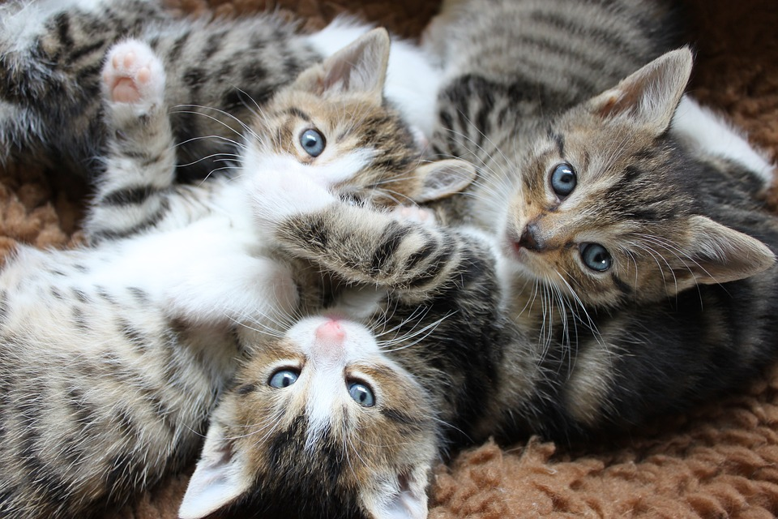
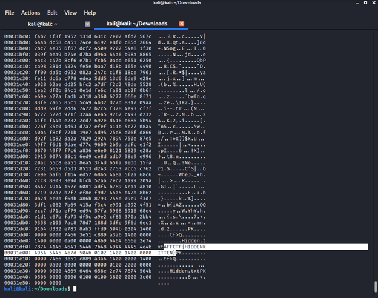

# One is missing

### Challenge

There was no challenge description. Instead, there was an adorable picture as seen below.

### Solution

One of the few first commands I utilized yielded the flag! As displayed below, doing a hexdump of the jpg (`xxd full_of__cuteness.jpg`) reveals this:

Therefore, the flag was found to be AFFCTF{HIDDENKITTEN}. The challenge's name now makes sense!
