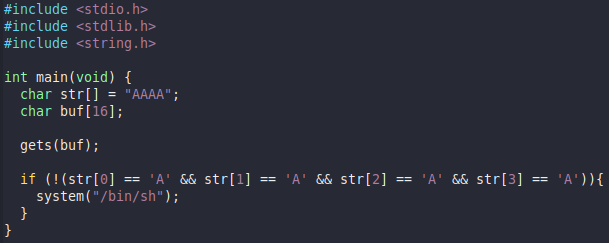
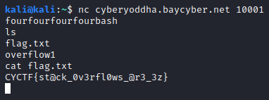

# Overflow 1

### Challenge

ez overflow.

nc cyberyoddha.baycyber.net 10001

\- Haskell#1426

Additionally, an overflow1.c file is given; the following image shows its contents.

### TL;DR Solution

`nc cyberyoddha.baycyber.net 10001`

`fourfourfourfourbash`

`cat flag.txt`

CYCTF{st@ck_0v3rfl0ws_@r3_3z}

### Extended Solution

With the source code, one can see that the character buffer size is 16.
system("/bin/sh") will also be run if any of str[] is not "A."
If str[] is entirely A's, this line will not be run.

First, the Netcat command provided in the Challenge `nc cyberyoddha.baycyber.net 10001` was utilized.

Now, knowing the buffer must overflow beyond 16 characters, one may type 16 arbitrary characters followed by "bash," such as "fourfourfourfourbash."

Because system("/bin/sh") ran the "bash" command, we now have access to a shell. Utilizing `ls` displays a file named flag.txt.

Running `cat flag.txt` reveals the flag to be CYCTF{st@ck_0v3rfl0ws_@r3_3z}.
