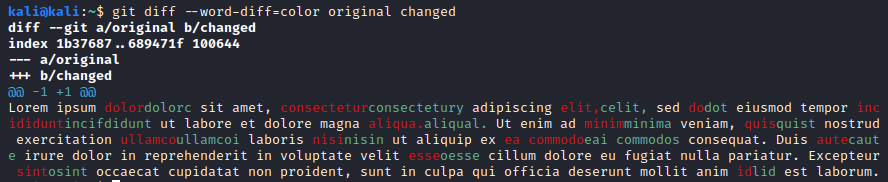

# Lorem Ipsum

## Challenge

Lorem ipsum dolorc sit amet, consectetury adipiscing celit, sed dot eiusmod tempor incifdidunt ut labore et dolore magna aliqual. Ut enim ad minima veniam, quist nostrud exercitation ullamcoi laboris nisin ut aliquip ex eai commodos consequat. Duis caute irure dolor in reprehenderit in voluptate velit oesse cillum dolore eu fugiat nulla pariatur. Excepteur osint occaecat cupidatat non proident, sunt in culpa qui officia deserunt mollit anim lid est laborum.

\- Haskell#1426

## Solution

Hmm, there are some differences between this Lorem Ipsum and the original.

Two files were created: an original containing ["The standard Lorem Ipsum passage"](https://www.lipsum.com and a changed containing the Challenge's contents.

Let's take a `git diff` as its --word-diff by color will be more comprehensive than `diff`, which will only show line-by-line.

Therefore, the command `git diff --word-diff=color original changed` was used.

Looking manually, one can see the letter differences are: cyctflatiniscool.

Knowing that the flags are formatted as CYCTF{flag}, one can see that this flag is CYCTF{latiniscool}!
